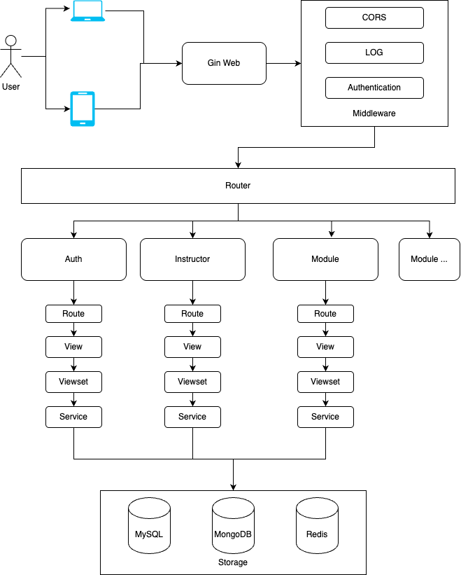

A example of a web APP that use Gin framework.


## Get started

install swag
```bash
go install github.com/swaggo/swag/cmd/swag@latest
go mod download
```

download dependency
```bash
go mod download
```

start service
```bash
make run-dev
```
## Architecture




### Project Directory

```text
├── api                     # web api
│   ├── auth                # connected with authentication, including User Login
│   │   ├── route.go        # authentication route 
│   │   ├── view.go         # authentication handles and swag documentation
│   │   ├── view_test.go    # web api tests
│   │   └── viewset.go      # authentication views
│   ├── instructor
│   │   ├── router.go
│   │   ├── view.go
│   │   ├── view_test.go
│   │   └── viewset.go
│   ├── middleware          # Gin Middleware
│   │   ├── auth.go         # Authentication Middleware
│   │   ├── content.go      # Core module for api viewset
│   │   └── cors.go         # CORS support Middleware
│   └── route.go            # Gin Routes
├── models                  # model structures
│   └── instructor.go
├── main.go
├── service                 # Vunction modules
│   ├── Instructor.go
│   ├── Instructor_test.go
│   ├── auth.go
│   └── auth_test.go
└── types                   # Various structures
    ├── auth.go
    ├── common.go           # common functions
    └── instructor.go
```

### Endpoints
```text
GET    /docs/*any                       # Swagger Documentation
            Provides API-related Swagger documentation, allowing users to browse and test the API online.
POST   /api/v1/auth/login               # User Login
            Authenticates user credentials and returns an access token for subsequent API requests.
GET    /api/v1/instructors              # List All Instructors
            Retrieves a list of all instructors, with support for pagination and filtering.
POST   /api/v1/instructors              # Create a New Instructor
            Adds a new instructor and returns the details of the created instructor.
GET    /api/v1/instructors/:id          # Get Instructor by ID
            Retrieves detailed information about a specific instructor based on the given ID.
PUT    /api/v1/instructors/:id          # Update Instructor Information
            Updates the details of a specific instructor using the provided ID. Supports both partial and full updates.
DELETE /api/v1/instructors/:id          # Delete an Instructor
            Removes an instructor based on the given ID. This action is irreversible.
```
